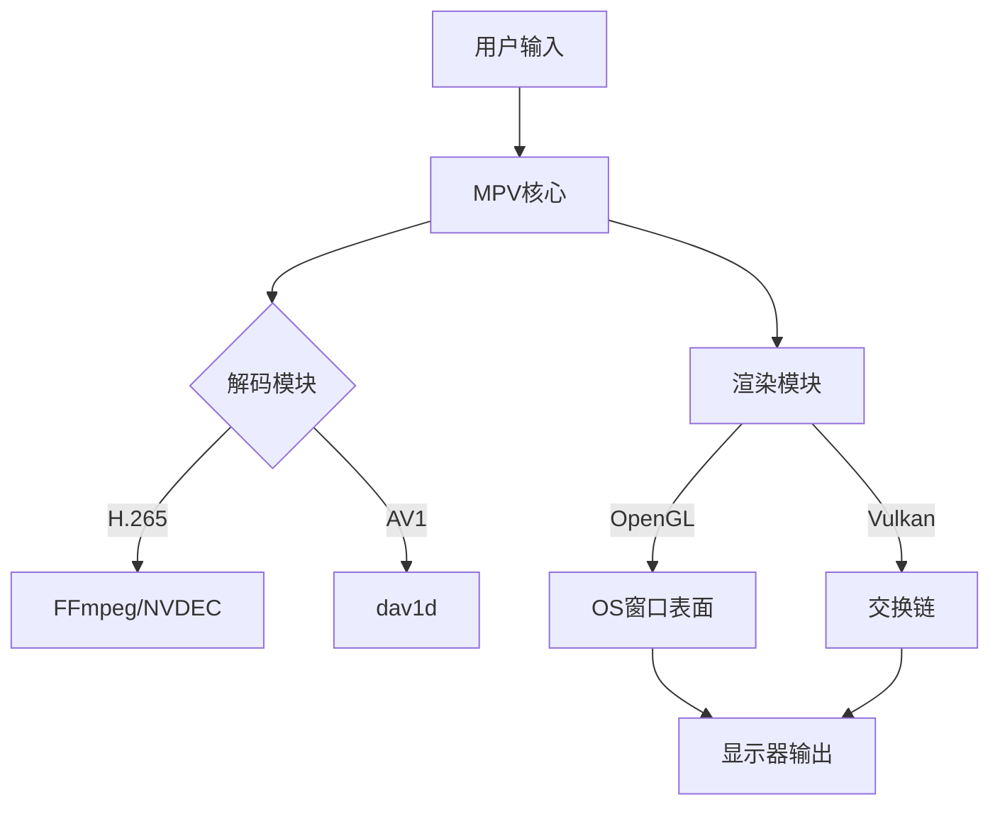

视频播放器的功能实现**不完全依赖**操作系统的图形界面控件，但其**显示输出**和**部分交互功能**需要与操作系统图形系统协作。以下是详细分析：

---

### **1. 视频播放器的核心模块**
视频播放器通常由多个独立模块组成，其中仅部分依赖操作系统GUI控件：

| **模块**           | **是否依赖OS GUI控件** | **说明**                                                                      |
| ------------------ | ---------------------- | ----------------------------------------------------------------------------- |
| **视频解码**       | ❌ 否                   | 依赖解码库（FFmpeg、硬件解码API），与GUI无关。                                |
| **音频输出**       | ❌ 否                   | 通过音频API（如ALSA/WASAPI）直接操作声卡。                                    |
| **画面渲染**       | ⚠️ 部分依赖             | 需要操作系统提供**渲染表面**（如窗口句柄），但渲染本身可由OpenGL/Vulkan接管。 |
| **用户界面（UI）** | ✅ 是                   | 进度条、按钮等控件依赖OS原生控件（如Win32按钮）或跨平台框架（如Qt）。         |
| **窗口管理**       | ✅ 是                   | 全屏/窗口化切换、多显示器适配等需调用OS窗口管理API。                          |

---

### **2. 关键依赖点**
#### **(1) 渲染表面（Rendering Surface）**
- **必需依赖**：  
  播放器需要操作系统提供一块**可视区域**（如窗口或全屏上下文），用于输出视频画面。  
  - *示例*：  
    - Windows：通过`HWND`（窗口句柄）关联Direct3D/Vulkan交换链。  
    - macOS：通过`NSView`绑定Metal渲染目标。  
    - Linux：通过X11/Wayland表面绑定OpenGL上下文。  

- **独立渲染的可能**：  
  若播放器仅输出到文件（如转码工具），则完全无需GUI控件。

#### **(2) 用户交互控件**
- **进度条/按钮**：  
  可选用操作系统原生控件（如Win32 API）或自行绘制（如游戏引擎风格的UI）。  
  - *跨平台框架*：Qt、Electron等抽象了OS控件，但底层仍依赖系统接口。

#### **(3) 硬件加速接口**
- **间接依赖**：  
  GPU解码（如NVDEC）需要通过驱动与操作系统图形栈（如Windows DXVA、Linux VA-API）交互，但无需直接调用GUI控件。

---

### **3. 非GUI播放器的存在**
某些场景下，视频播放器可完全脱离图形界面运行：
- **命令行播放器**：  
  - 如`mpv --vo=null`（无视频输出，仅解码）。  
  - 依赖FFmpeg解码，但无需创建窗口。  
- **嵌入式/无头设备**：  
  - 视频解码后直接输出到帧缓冲区（`/dev/fb0`）或网络流，不依赖GUI系统。  

---

### **4. 操作系统图形界面的作用**
即使播放器使用自定义UI，仍需操作系统提供以下支持：

| **功能**         | **OS提供的支持**                     | **播放器替代方案**                |
| ---------------- | ------------------------------------ | --------------------------------- |
| **窗口创建**     | 必须（如`CreateWindowEx`）           | 无（无法绕过）                    |
| **输入事件处理** | 必须（鼠标/键盘事件）                | 可自行监听输入（如SDL库）         |
| **高分辨率缩放** | DPI感知API（如`SetProcessDPIAware`） | 手动处理缩放逻辑                  |
| **多显示器适配** | 依赖OS显示器管理API                  | 需调用`EnumDisplayMonitors`等函数 |

---

### **5. 现代播放器的架构示例**
以MPV播放器为例：

- **核心解码/渲染**：完全独立于OS GUI控件。  
- **窗口绑定**：必须依赖操作系统API创建显示区域。  

---

### **6. 总结**
- **必须依赖**：  
  - 窗口/表面管理（显示视频的必要条件）。  
  - 输入事件传递（用户交互基础）。  
- **无需依赖**：  
  - 解码、音视频同步、滤镜处理等核心功能。  
- **灵活选择**：  
  - UI控件可使用OS原生或自定义实现（如游戏引擎风格UI）。  

因此，视频播放器的**核心功能**不依赖操作系统图形控件，但**显示和交互**必须与图形系统协作。
