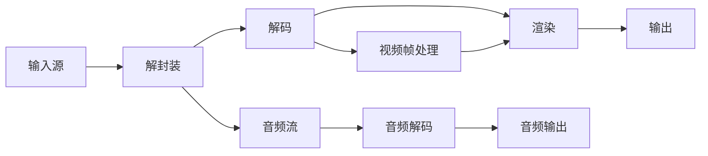
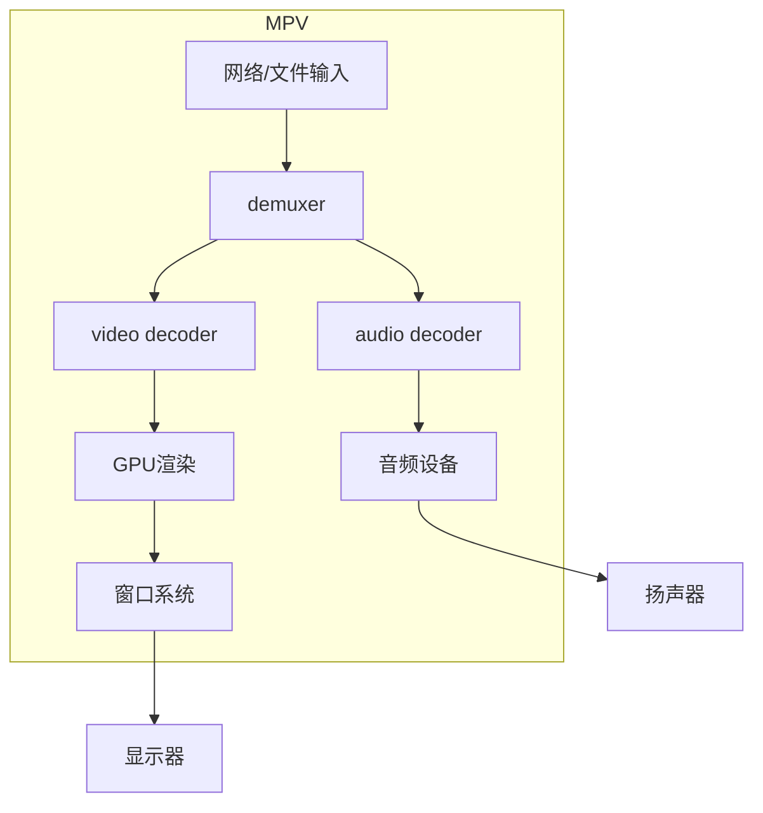

视频播放器的设计原理涉及 **多媒体处理流水线**、**跨模块协作** 和 **性能优化**，其核心目标是将压缩的视频数据解码后流畅呈现给用户。以下是分模块的详细设计原理：

---

### **1. 核心模块与工作流程**

#### **(1) 输入与解封装（Demuxing）**
- **功能**：解析容器格式（如MP4/MKV），分离视频、音频、字幕等数据流。
- **关键操作**：
  - 读取文件头信息（编码格式、分辨率、时长等）。
  - 分离视频包（H.264/H.265）、音频包（AAC/MP3）、字幕（SRT/ASS）。
- **依赖库**：FFmpeg（`libavformat`）、GStreamer。

#### **(2) 解码（Decoding）**
- **视频解码**：
  - **软件解码**：CPU运行解码算法（如FFmpeg的`libavcodec`）。
  - **硬件解码**：调用GPU专用单元（NVDEC/Quick Sync）。
- **音频解码**：PCM数据转换，重采样（如48kHz→44.1kHz）。
- **同步机制**：基于时间戳（PTS/DTS）对齐音视频。

#### **(3) 渲染与输出**
- **视频渲染**：
  - **GPU加速**：通过OpenGL/Direct3D/Vulkan渲染YUV→RGB转换、缩放。
  - **叠加处理**：字幕、滤镜（如锐化）应用。
- **音频输出**：通过操作系统音频API（ALSA/WASAPI/Core Audio）播放。
- **显示绑定**：关联到操作系统窗口句柄（如Windows的`HWND`）。

---

### **2. 关键设计原则**
#### **(1) 流水线化（Pipeline）**
- **多线程模型**：
  - **解封装线程**：持续读取数据包。
  - **解码线程**：视频和音频独立解码。
  - **渲染线程**：GPU提交与显示刷新同步（VSync）。
- **缓冲队列**：防止线程阻塞（如解码帧队列、音频采样缓冲）。

#### **(2) 硬件加速优化**
- **零拷贝（Zero-Copy）**：  
  解码后的帧直接送入GPU显存（如NVIDIA的CUDA Interop）。
- **混合解码**：  
  硬解失败时自动切换软解（FFmpeg的`hwaccel`机制）。

#### **(3) 动态适应**
- **码率自适应**：  
  根据网络带宽切换分辨率（如DASH流媒体）。
- **功耗管理**：  
  笔记本低电量时禁用硬件解码，改用低功耗软解。

---

### **3. 用户交互与扩展功能**
#### **(1) 控件设计**
- **播放控制**：  
  播放/暂停/跳转通过事件队列通知解码线程。
- **进度条**：  
  基于解封装获取的总时长和当前解码帧的PTS计算。

#### **(2) 高级功能**
- **字幕渲染**：  
  动态混合到视频帧（需字体渲染和时序对齐）。
- **滤镜链**：  
  实时应用色彩校正、超分（如Waifu2x）。
- **流媒体支持**：  
  协议处理（HTTP/RTMP）与缓冲策略（如HLS分片预加载）。

---

### **4. 跨平台实现差异**
    
| **平台**    | **视频渲染API**        | **音频输出**     | **硬件加速方案**              |
| ----------- | ---------------------- | ---------------- | ----------------------------- |
| **Windows** | Direct3D11/DXVA        | WASAPI           | NVIDIA NVENC/Intel Quick Sync |
| **macOS**   | Metal/Videotoolbox     | Core Audio       | Apple M系列解码引擎           |
| **Linux**   | OpenGL/VA-API          | ALSA/PulseAudio  | AMD AMF/Intel VA-API          |
| **Android** | SurfaceView/MediaCodec | AAudio/OpenSL ES | Adreno/NVIDIA移动端解码       |

---

### **5. 性能优化技巧**
- **帧丢弃策略**：  
  网络卡顿时跳过非关键帧（B帧），优先解码关键帧（I帧）。
- **延迟优化**：  
  游戏模式中禁用音频重采样，减少缓冲帧数。
- **内存管理**：  
  环形缓冲区复用视频帧内存，避免频繁分配释放。

---

### **6. 现代播放器架构示例（MPV）**

- **特点**：  
  - 解耦模块，通过消息队列通信。  
  - 支持插件化滤镜和脚本控制（Lua）。

---

### **总结**
视频播放器的设计核心是 **“分模块协作”** 与 **“资源高效利用”**：  
1. **模块化**：解封装、解码、渲染分离，便于维护和扩展。  
2. **性能优先**：硬件加速、多线程、动态码率适配。  
3. **用户体验**：低延迟、音画同步、交互响应。  

开发者需平衡兼容性（如软解回退）与性能（硬解优化），同时适应不同操作系统和硬件环境。
